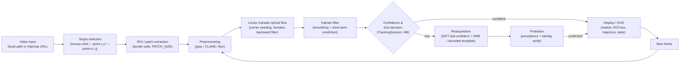

# System Block Diagram

End-to-end data flow of the Selected-Object Video Tracker. The pipeline runs
per frame on the CPU; all tunable parameters live in
[`ground_target_tracking/config.py`](../ground_target_tracking/config.py).

## Stages

| Stage | Module | Role |
|-------|--------|------|
| Video input | `utils.open_video` | Accept a local file **or** an http/rtsp URL; open with OpenCV. |
| Target selection | `main.select_point_interactive` / `--point` / `--point-rc` | Pick the pixel on the first frame. |
| ROI / patch | `main.build_patch`, `config.PATCH_SIZE` | Border-safe window around the pixel. |
| Preprocessing | `preprocessing` | Per-method grayscale / CLAHE / blur. |
| Optical flow | `trackers.OpticalFlowTracker` | Follow the point frame-to-frame (Lucas–Kanade). |
| Kalman | `trackers.KalmanWrapper` | Smooth jitter; coast briefly on prediction. |
| Confidence & loss | `session.TrackingSession` | Score reliability; own the state machine. |
| Reacquisition | `reacquisition.Reacquirer` | Re-find the same object after `LOST`. |
| Display / HUD | `utils.draw_*`, `main` loop | Simple UI: marker, box, trajectory, state. |

See [`tracking_state_machine.md`](tracking_state_machine.md) for the states and
transitions surfaced in the HUD.
