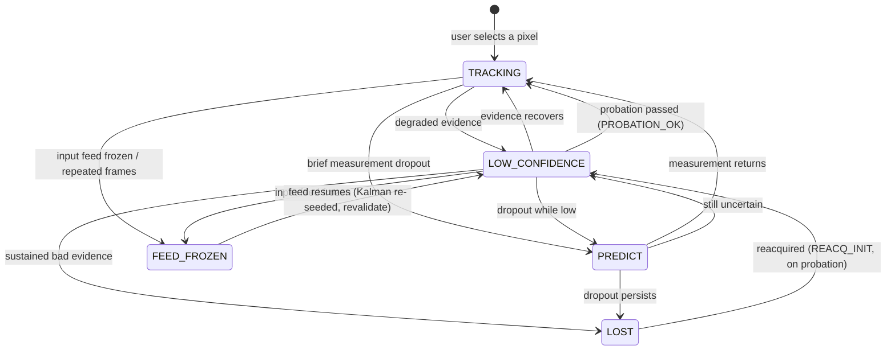

# Tracking State Machine

This explains the on-screen state labels so a reviewer watching the demo videos
knows what each one means. The states are **intentional, conservative behaviour** —
they are *not* crashes. The tracker is designed to **hold honestly** (and say so)
rather than guess and drift onto the wrong object.

## States shown in the HUD

| State | Meaning |
|-------|---------|
| **TRACKING** | Confident lock; the box follows the object. |
| **LOW_CONFIDENCE** | Still measuring, but degraded (appearance mismatch, frame edge, or a re-seeded tracker on probation just after reacquisition). A cautious "not fully sure" — not a failure. |
| **PREDICT** | A brief Kalman coast through a short measurement dropout (a few frames). |
| **LOST** | Tracking is no longer trustworthy; the estimate **freezes** and the box turns red. While enabled, the program then **searches** for the object and re-locks when it returns. Preferring `LOST` over a wrong lock is deliberate. |
| **FEED_FROZEN** | A **feed-integrity** state, not target loss: the *input feed itself* is frozen / repeating identical frames. The last position is held ("FEED FROZEN — holding last position"), evidence and reacquisition search are suspended, and on the feed resuming the tracker re-validates from `LOW_CONFIDENCE`. |

## Internal phases (not separate on-screen labels)

Reacquisition has two internal phases that **map onto the visible states**, so you
will not see them as their own HUD labels:

- **`REACQ_INIT` / searching** → shown as **LOST** (the search runs while lost).
- **`PROBATION`** → shown as **LOW_CONFIDENCE** (a re-seeded tracker earning trust).

So on screen a full lose-and-recover cycle reads:
**TRACKING → LOST → LOW_CONFIDENCE → TRACKING.**
The `REACQ_INIT` and `PROBATION_OK` events are printed to the console (the `[M9-c]`
log lines) for anyone who wants to see the exact moment of reacquisition.

## Transitions

Note: `REACQ_INIT` (LOST → LOW_CONFIDENCE) and `PROBATION_OK`
(LOW_CONFIDENCE → TRACKING) are the reacquisition phases described above; they are
console events, not extra HUD labels.
